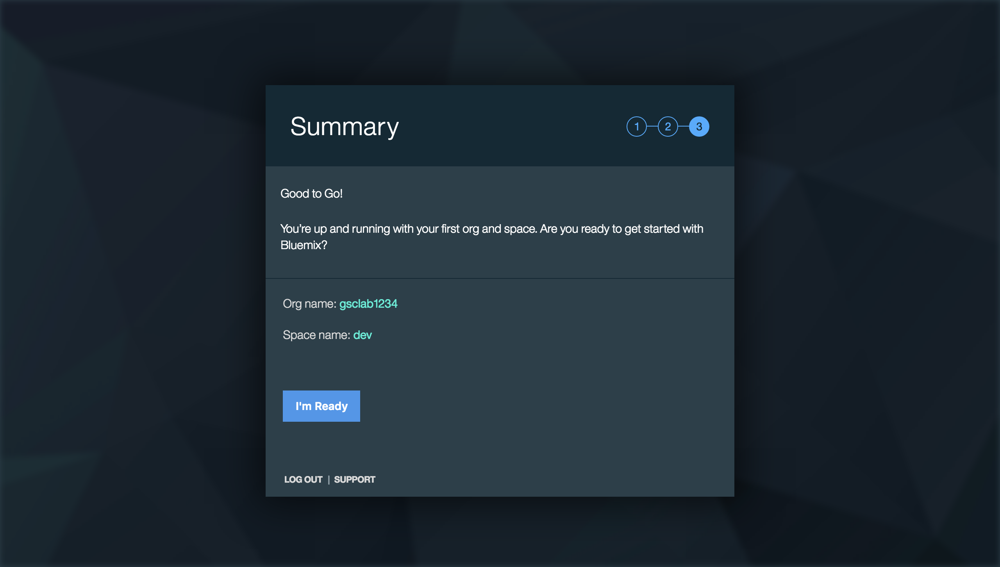
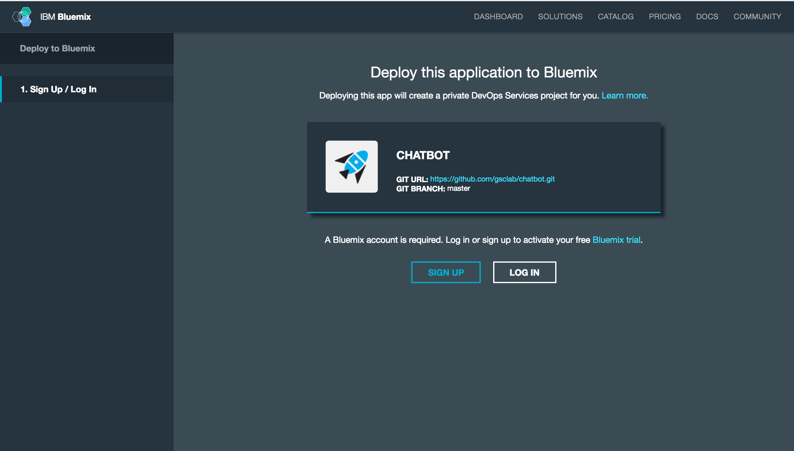
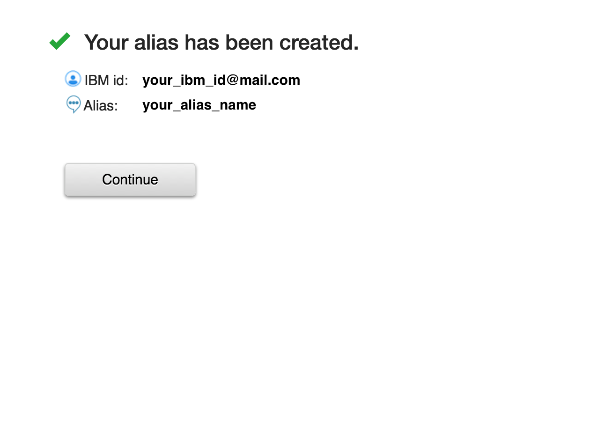

# chatbot-app

Welcome! This section will walk you through the lab prerequisites. This should have been already seen and completed as pre-work, they are included for your completeness.


<a name="bluemix">
# Getting Started using Bluemix
</a>


## Before you begin

#1. Ensure that you have a [Bluemix account](https://console.ng.bluemix.net/registration/).

  1.1 Fill the required details and click Create Account.
   

   You receive a message to check your mail.
   

   1.2 Check your registered mail and find a mail to confirm your bluemix account.

   

   Click Confirm your account and get a Success message.
   

   1.3 Click Login and enter your Bluemix credentials.
   
   #
   

   1.4 Create an Organization and space and then go to I'm Ready.
   
   #
   
   #
   
 
 You reach your Bluemix Dashboard.
 

2. Ensure that you have the necessary space available in your Bluemix account. This action requires to deploys 1 application and 2 services.
   * You can view this on your Bluemix Dashboard. Tiles will show what space you have available.
   * For example, for Services & APIS

    &nbsp;&nbsp;&nbsp;&nbsp;&nbsp;&nbsp;&nbsp;&nbsp;&nbsp;&nbsp;&nbsp;&nbsp;
   * For Cloud Foundry Apps
    &nbsp;&nbsp;&nbsp;&nbsp;&nbsp;&nbsp;&nbsp;&nbsp;&nbsp;&nbsp;&nbsp;&nbsp;

## Deploy the App
1. Select Deploy to Bluemix.

&nbsp;&nbsp;&nbsp;&nbsp;&nbsp;&nbsp;&nbsp;&nbsp;&nbsp;&nbsp;&nbsp;&nbsp; [](https://bluemix.net/deploy?repository=https://github.com/vikramrengarajan/gscfss-conversation-tone)

2 Log in with an existing Bluemix account or sign up.

3 Name your app and select your REGION, ORGINIZATION, and SPACE. Then select DEPLOY.
&nbsp;&nbsp;&nbsp;&nbsp;&nbsp;&nbsp;&nbsp;&nbsp;&nbsp;&nbsp;&nbsp;&nbsp; 

If asked to pick up an alias,:


    Create an alias and click continue.


If not continue to fill details for the app.
&nbsp;&nbsp;&nbsp;&nbsp;&nbsp;&nbsp;&nbsp;&nbsp;&nbsp;&nbsp;&nbsp;&nbsp; 


* This performs two actions:
  - Creates the app
  - Creates a Conversation and Tone Analyzer service instance that the user needs for workspace creation
  

* The status of the deployment is shown. This can take some time.

&nbsp;&nbsp;&nbsp;&nbsp;&nbsp;&nbsp;&nbsp;&nbsp;&nbsp;&nbsp;&nbsp;&nbsp;

4 Once your app has deployed, select VIEW YOUR APP.

&nbsp;&nbsp;&nbsp;&nbsp;&nbsp;&nbsp;&nbsp;&nbsp;&nbsp;&nbsp;&nbsp;&nbsp;

<a name="returnbluemix">
5 Navigate to your Bluemix Dashboard and [import a workspace](#workspace). Setup your workspace then <b>return to these steps</b>.
</a>

6 After you have set up a workspace, [add the WORKSPACE_ID environment variable](#env).

<a name="local">
# Getting Started locally
</a>

## Before you begin

1 Ensure that you have a [Bluemix account](https://console.ng.bluemix.net/registration/). While you can do part of this deployment locally, you must still use Bluemix.

<a name="returnlocal">
2 In Bluemix, [create a Conversation Service](http://www.ibm.com/watson/developercloud/doc/conversation/convo_getstart.shtml).
- [Import a workspace](#workspace)
- Copy the [Service Credentials](#credentials) for later use.
- <b>Return to these steps</b>
</a>

## Building locally

To build the application:

1 Download and install the [Cloudfoundry CLI](https://github.com/cloudfoundry/cli) tool.

2 Git clone the project `https://github.com/watson-developer-cloud/conversation-simple`

3 Navigate to the `conversation-simple` folder

4 Edit the `manifest.yml` file, and change the `<application-name>` to something unique.
  ```none
  declared-services:
   conversation-service:
    label: conversation
    plan: free
   tone-analyzer-standard:
    label: tone_analyzer
    plan: standard
    
 applications:
 - path: .
  memory: 256M
  instances: 1
  domain: mybluemix.net
  name: gscfss-conversation-tone
  host: gscfss-conversation-tone
  disk_quota: 1024M
  services:
  - conversation-service
  - tone-analyzer-standard
  name: tone-analyzer-demo
  ```

  The name you use determinates your application URL initially, such as `<application-name>.mybluemix.net`.

5 Connect to Bluemix in the command-line tool:
  For US Region
  ```sh
  $ cf api https://api.ng.bluemix.net
  ```

  ```sh
  $ cf login -u <your user ID>
  ```

6 Create the Conversation service in Bluemix:

  ```sh
  $ cf create-service conversation free conversation-service
  ```

7 Push it live:

  ```sh
  $ cf push
  ```  
## Running locally

  The application uses [Node.js](http://nodejs.org/) and [npm](https://www.npmjs.com/).

1 Copy the credentials from your `conversation-service` service in Bluemix to a `.env` file in the root.

2 Use the Conversation tooling app to [import a workspace](#workspace) and add the workspace ID environment variable to the `.env` file. For details about obtaining the workspace ID, see Step 5 in the workspace section.

3 Install [Node.js](http://nodejs.org/).

4 Open the terminal, go to the project folder, and run this command:
    ```
    npm install
    ```

5  Start the application by running this command:
    ```
    npm start
    ```

6 Open `http://localhost:3000` in a browser.

<a name="credentials">
# Service Credentials
</a>

1 Go to the Bluemix Dashboard and select the Conversation service instance. Once there, select the **Service Credentials** menu item.

&nbsp;&nbsp;&nbsp;&nbsp;&nbsp;&nbsp;&nbsp;&nbsp;&nbsp;&nbsp;&nbsp;&nbsp;

2 Select **ADD CREDENTIALS**. Name your credentials then select **ADD**.

3 Copy the credentials (or remember this location) for later use.


<a name="workspace">
# Import a workspace
</a>

To use the app you're creating, you need to add a worksapce to your Conversation service. A workspace is a container for all the artifacts that define the behavior of your service (ie: intents, entities and chat flows). For this sample app, a workspace is provided.

For more information on workspaces, see the full  [Conversation service  documentation](https://www.ibm.com/smarterplanet/us/en/ibmwatson/developercloud/doc/conversation/overview.shtml).

1 Navigate to the Bluemix dashboard, select the Conversation service that you created.

2 Go to the **Manage** menu item and select **Launch Tool**. This opens a new tab in your browser, where you are prompted to login if you have not done so before. Use your Bluemix credentials.

3 If you are deploying through Bluemix, download the [exported JSON file](https://raw.githubusercontent.com/watson-developer-cloud/conversation-simple/master/training/car_workspace.json) that contains the Workspace contents. If deploying locally,  this was cloned and is in the training folder (training/car_workspace.json).

4 Select the import icon: . Browse to (or drag and drop) the JSON file. Choose to import **Everything(Intents, Entities, and Dialog)**. Then select **Import** to finish importing the workspace.

5 Refresh your browser. A new workspace tile is created within the tooling. Select the _menu_ button within the workspace tile, then select **View details**:

&nbsp;&nbsp;&nbsp;&nbsp;&nbsp;&nbsp;&nbsp;&nbsp;&nbsp;&nbsp;&nbsp;&nbsp;

<a name="workspaceID">
In the Details UI, copy the 36 character UNID **ID** field. This is the **Workspace ID**.
</a>

&nbsp;&nbsp;&nbsp;&nbsp;&nbsp;&nbsp;&nbsp;&nbsp;&nbsp;&nbsp;&nbsp;&nbsp; 

6 Return to the deploy steps that you were following:
- For Local - [return to step 2](#returnlocal)
- For Bluemix - [return to step 5](#returnbluemix)

<a name="env">
# Adding environment variables in Bluemix
</a>

1 In Bluemix, open the application from the Dashboard. Select **Environment Variables**.

2 Select **USER-DEFINED**.

3 Select **ADD**.

4 Add a variable with the name **WORKSPACE_ID**. For the value, paste in the Workspace ID you [copied earlier](#workspaceID). Select **SAVE**.

&nbsp;&nbsp;&nbsp;&nbsp;&nbsp;&nbsp;&nbsp;&nbsp;&nbsp;&nbsp;&nbsp;&nbsp;

5 Restart your application.


# Troubleshooting in Bluemix

#### In the Classic Experience:
- Log in to Bluemix, you'll be taken to the dashboard.
- Navigate to the the application you previously created.
- Select **Logs**.

&nbsp;&nbsp;&nbsp;&nbsp;&nbsp;&nbsp;&nbsp;&nbsp;&nbsp;&nbsp;&nbsp;&nbsp;

- If you want, filter the LOG TYPE by "APP".

&nbsp;&nbsp;&nbsp;&nbsp;&nbsp;&nbsp;&nbsp;&nbsp;&nbsp;&nbsp;&nbsp;&nbsp;

#### In the new Bluemix:
- Log in to Bluemix, you'll be taken to the dashboard.
- Select **Compute**

&nbsp;&nbsp;&nbsp;&nbsp;&nbsp;&nbsp;&nbsp;&nbsp;&nbsp;&nbsp;&nbsp;&nbsp;

- Select the application you previously created.
- Select **Logs**.

&nbsp;&nbsp;&nbsp;&nbsp;&nbsp;&nbsp;&nbsp;&nbsp;&nbsp;&nbsp;&nbsp;&nbsp;

- If you want, filter the Log Type by selecting the drop-down and selecting **Application(APP)**.

&nbsp;&nbsp;&nbsp;&nbsp;&nbsp;&nbsp;&nbsp;&nbsp;&nbsp;&nbsp;&nbsp;&nbsp;

# Troubleshooting with CLI

To see the logs, run the command

`$ cf logs < application-name > --recent`
 
# License

  This sample code is licensed under Apache 2.0.
  Full license text is available in [LICENSE](LICENSE).


## Open Source @ IBM

  Find more open source projects on the
  [IBM Github Page](http://ibm.github.io/).

