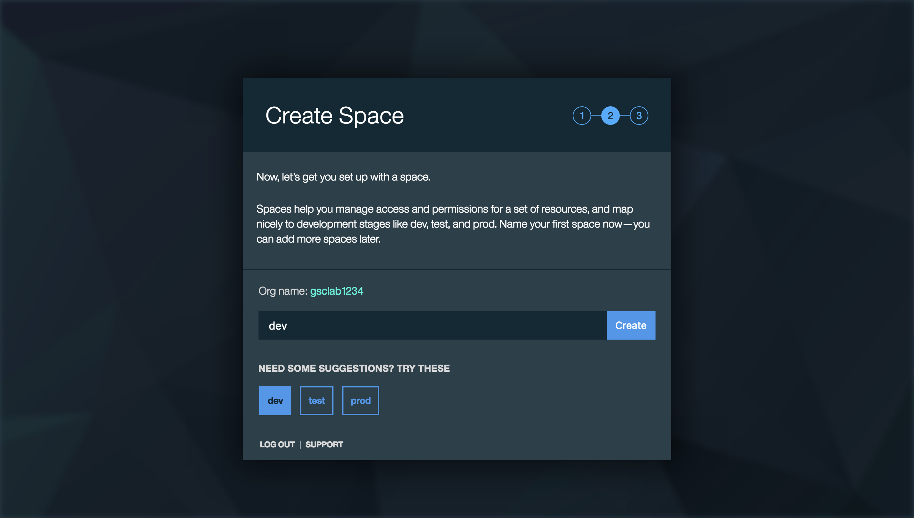
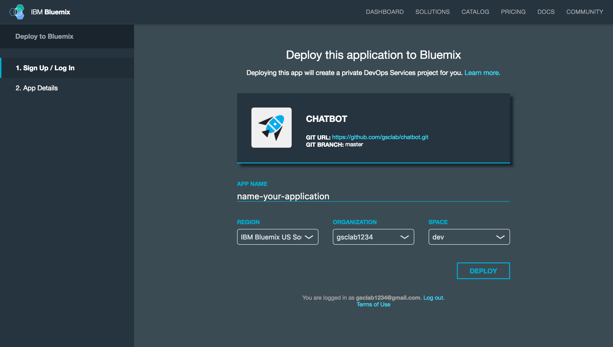
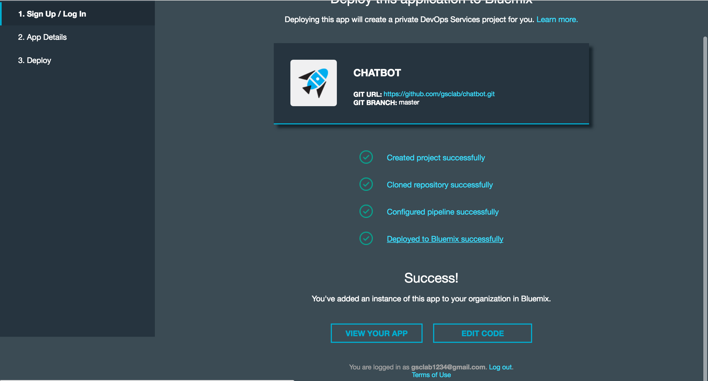

# chatbot-app

Welcome! This section will walk you through the lab prerequisites. This should have been already seen and completed as pre-work, they are included for your completeness.

<a name="bluemix">
# Getting Started using Bluemix
</a>

## Before you begin

<b>1. Ensure that you have a [Bluemix account](https://console.ng.bluemix.net/registration/).</b>

  1.1 Please fill the required details and click Create Account.

  &nbsp;&nbsp;&nbsp;&nbsp;&nbsp;&nbsp;&nbsp;&nbsp;&nbsp;&nbsp;&nbsp;&nbsp; 

   You will receive a message to check your mail.

   &nbsp;&nbsp;&nbsp;&nbsp;&nbsp;&nbsp;&nbsp;&nbsp;&nbsp;&nbsp;&nbsp;&nbsp; 

   1.2 Please check your registered mail and find a mail to confirm your bluemix account.

   &nbsp;&nbsp;&nbsp;&nbsp;&nbsp;&nbsp;&nbsp;&nbsp;&nbsp;&nbsp;&nbsp;&nbsp; 

   1.3 Click on Confirm your account and receive a Success message.

   &nbsp;&nbsp;&nbsp;&nbsp;&nbsp;&nbsp;&nbsp;&nbsp;&nbsp;&nbsp;&nbsp;&nbsp;  

   1.4 Click Login and login with your Bluemix credentials.

   &nbsp;&nbsp;&nbsp;&nbsp;&nbsp;&nbsp;&nbsp;&nbsp;&nbsp;&nbsp;&nbsp;&nbsp;  
   

   1.5 Create an Organization and enter any organization name.

   &nbsp;&nbsp;&nbsp;&nbsp;&nbsp;&nbsp;&nbsp;&nbsp;&nbsp;&nbsp;&nbsp;&nbsp; 

   1.6 Create a Space and enter a space name, you can also choose the default spaces mentioned below say dev.

   &nbsp;&nbsp;&nbsp;&nbsp;&nbsp;&nbsp;&nbsp;&nbsp;&nbsp;&nbsp;&nbsp;&nbsp; 
   

   1.7 You will receive a success message, please click I'm Ready

   &nbsp;&nbsp;&nbsp;&nbsp;&nbsp;&nbsp;&nbsp;&nbsp;&nbsp;&nbsp;&nbsp;&nbsp; 
 

 You will land on your Bluemix Dashboard.

 &nbsp;&nbsp;&nbsp;&nbsp;&nbsp;&nbsp;&nbsp;&nbsp;&nbsp;&nbsp;&nbsp;&nbsp; 

<b> 2. Ensure that you have the necessary space available in your Bluemix account. You requires to deploy 1 application and 2 services.</b>
   * You can view this on your Bluemix Dashboard. Tiles will show what space you have available.
   * For Services & APIS you would need two services.

&nbsp;&nbsp;&nbsp;&nbsp;&nbsp;&nbsp;&nbsp;&nbsp;&nbsp;&nbsp;&nbsp;&nbsp;

   * For Cloud Foundry Apps you would require at least 256 MB of free space.

&nbsp;&nbsp;&nbsp;&nbsp;&nbsp;&nbsp;&nbsp;&nbsp;&nbsp;&nbsp;&nbsp;&nbsp;

## Deploy the App

1. Click on the Deploy to Bluemix below.

&nbsp;&nbsp;&nbsp;&nbsp;&nbsp;&nbsp;&nbsp;&nbsp;&nbsp;&nbsp;&nbsp;&nbsp; 

2. Log in with your Bluemix account.

&nbsp;&nbsp;&nbsp;&nbsp;&nbsp;&nbsp;&nbsp;&nbsp;&nbsp;&nbsp;&nbsp;&nbsp; 

3. If asked to pick up an alias by following the steps below, else go to the next step.

3.1 Enter a unique alias name and click create.
&nbsp;&nbsp;&nbsp;&nbsp;&nbsp;&nbsp;&nbsp;&nbsp;&nbsp;&nbsp;&nbsp;&nbsp; 

3.2 Verify your alias name and click continue.
&nbsp;&nbsp;&nbsp;&nbsp;&nbsp;&nbsp;&nbsp;&nbsp;&nbsp;&nbsp;&nbsp;&nbsp; 

4. Name your app and select your Region, Organization and space and Click Deploy.

&nbsp;&nbsp;&nbsp;&nbsp;&nbsp;&nbsp;&nbsp;&nbsp;&nbsp;&nbsp;&nbsp;&nbsp; 

* This performs two actions:
  - Creates the app
  - Creates a Conversation and Tone Analyzer service instance that the user needs for workspace creation
  

* The status of the deployment is shown. This can take some time.

&nbsp;&nbsp;&nbsp;&nbsp;&nbsp;&nbsp;&nbsp;&nbsp;&nbsp;&nbsp;&nbsp;&nbsp;

5. Once your app has deployed, select VIEW YOUR APP.

&nbsp;&nbsp;&nbsp;&nbsp;&nbsp;&nbsp;&nbsp;&nbsp;&nbsp;&nbsp;&nbsp;&nbsp;

6. Your application is succesfully deployed and the pre-work for you is completed.

# License

  This sample code is licensed under Apache 2.0.
  Full license text is available in [LICENSE](LICENSE).

## Open Source @ IBM

  Find more open source projects on the
  [IBM Github Page](http://ibm.github.io/).

